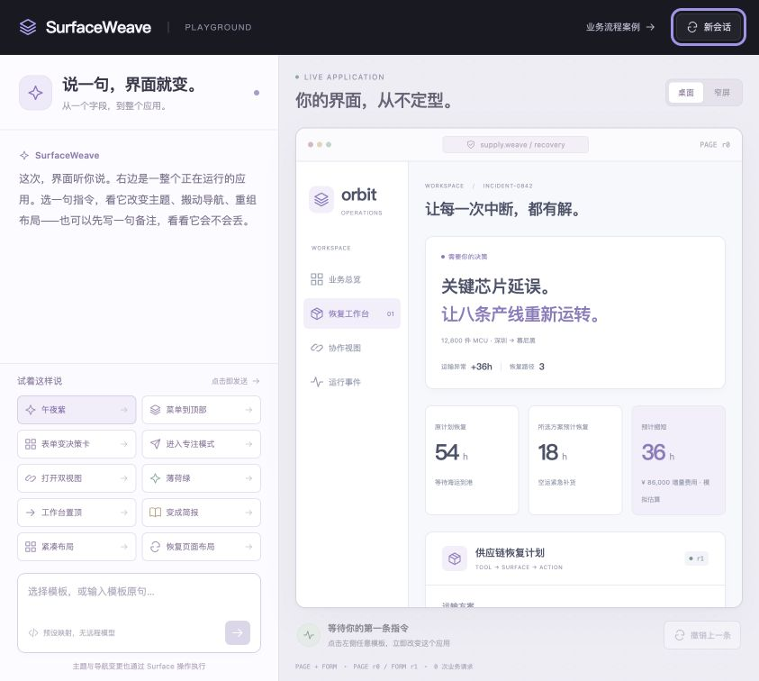
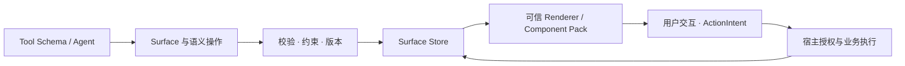

# SurfaceWeave

**让 Agent 改变界面，让用户的输入和业务规则继续成立。**

A protocol-first runtime for agent-generated, tool-driven UI.

[](https://github.com/chenrgSix/SurfaceWeave/actions/workflows/ci.yml)
[](https://chenrgsix.github.io/SurfaceWeave/)
[](https://www.npmjs.com/package/@surfaceweave/core)
[](LICENSE)

[在线体验](https://chenrgsix.github.io/SurfaceWeave/playground/) · [使用文档](https://chenrgsix.github.io/SurfaceWeave/) · [快速接入](docs/guide/getting-started.md) · [架构与协议](docs/dynamic-ui-architecture.md)

SurfaceWeave 把页面描述为可序列化的 **Surface**：组件树、布局、数据绑定和版本。Agent 提出结构化变更，运行时校验并更新状态，可信 Component Pack 渲染界面。真正的业务执行仍由宿主授权。

因此，应用可以在使用过程中重新组织：选择框变成决策卡，导航迁移，多个视图共享输入，甚至整个页面重建。界面变化可以被核查，不必牺牲数据和执行边界。

[](https://chenrgsix.github.io/SurfaceWeave/playground/)

## 先看它如何改变一个应用

打开 **[在线 Playground](https://chenrgsix.github.io/SurfaceWeave/playground/)**，不用安装，也不需要 Key 就能体验固定对话模板。

1. 先在工作台写一句备注。
2. 点击「菜单到顶部」「表单变决策卡」「打开双视图」，观察结构和组件变化。
3. 在其中一个工作台继续修改输入，另一个视图同步更新。
4. 点击「撤销上一条」：恢复界面结构，保留最新输入。

接入自己的临时模型后，可以提出模板以外的要求：

> 改成天空蓝，把菜单移到右侧。重新设计成晚班指挥台：新增交接说明卡和两张示意指标卡，用双栏排列，保留实际工作台、审批和我的输入。

模型可以使用自定义颜色令牌、四向导航，以及卡片、文本、指标、Section、Stack、Grid 等注册组件，生成新的页面树。整页重建调用真实的 `replaceSurface`；局部调整使用 `setProps`、`moveNode`、`setLayout` 等语义操作。

展开对话中的 SDK 回执，可以核对原始参数、实际版本、变更前后的树。模型只返回“已完成”却没有调用工具时，不会被记为执行成功。

## SurfaceWeave 负责什么

| 能力               | 实际机制                                 | 带来的结果                      |
| ------------------ | ---------------------------------------- | ------------------------------- |
| 从业务定义生成 UI  | JSON Schema / Tool Definition → Surface  | 表单与结果界面来自契约          |
| 使用过程中调整界面 | 语义操作与整树替换                       | 可以换布局、分组和可信组件      |
| 在变化中保留状态   | 独立数据、稳定字段身份与绑定             | 重排和替换不必重新填写表单      |
| 拒绝不成立的修改   | Schema、硬约束、`baseRevision`、原子批次 | 无效或过期操作不会部分写入      |
| 多视图与多组件包   | 同一 Store 的订阅、可替换 Renderer 绑定  | 一份 Surface 可在不同视图中呈现 |
| 守住业务执行边界   | `ActionIntent`、确认快照、Host Executor  | UI 变更不会自动获得业务执行权限 |
| 保存长期偏好       | 独立偏好运行时、作用域与迁移             | 会话调整和持久设置分别管理      |



Core 不依赖 React、DOM、Tauri 或模型 SDK。React、React Aria、Ant Design 和桌面能力通过独立包接入。Wire 中传递声明和数据，不传递可执行组件代码。

## Demo 中哪些是真的

- **真实运行时：** 组件注册、Schema 生成、Store、布局变更、版本冲突、硬约束、共享视图、确认与撤销都通过 SurfaceWeave 执行。
- **两种对话来源：** 模板按钮固定映射，不做 LLM 推理；自由输入在配置模型后才请求用户指定的接口，不会在失败时偷偷回退模板。
- **模拟业务：** 物流数据、费用估算与 Host 回执是演示数据。生成卡片中的文案和指标也只是展示内容，不是业务证据。
- **动态范围：** 模型可以组合已注册组件、生成页面树；新的组件行为仍需开发者提供可信实现。它不能生成任意 JavaScript、绕过审批或新增业务执行工具。
- **状态范围：** 共享发生在同页同一个 Store；不是跨设备协作。当前 Demo 的对话、撤销和临时配置只存在内存中。

页面外壳与业务表单是独立的 Surface。Demo 允许重建页面内容，同时保留可见的导航、容器与主工作台；业务字段、绑定、强制审批和执行权限继续受保护。[完整能力与验收边界](docs/guide/conversation-playground.md)。

## 使用自己的模型

在 Playground 点击「接入模型」，填写支持 **OpenAI 兼容 Chat Completions + function calling** 的接口、模型 ID 和临时 Key。

- 请求直接由浏览器发往你填写的地址。GitHub Pages 只托管静态应用，不提供模型代理、共享 Key 或业务后端。
- 在线模型接口需要 HTTPS，并允许 `https://chenrgsix.github.io` 来源的 CORS；路径 `/SurfaceWeave/` 不属于 Origin。连接本机 HTTP 模型时建议运行本地 Demo。
- 请求包含指令、最近对话、页面树与组件说明，不包含表单 `data`。不要把秘密写进对话或页面标题。
- Key 不写入 localStorage、Cookie、仓库或部署产物。刷新、新会话或断开会清除临时配置；浏览器中的 Key 仍可能被扩展或脚本读取，**只使用可撤销、低额度的测试 Key**。生产接入应使用服务端代理。
- 每次对话最多 4 轮，每个模型请求最多等待 **5 分钟**，可以手动停止。真实模型质量、额度与协议兼容性取决于你的服务商。

自动化验收使用明确标记的协议响应 fixture，不能代表某个真实模型的推理质量。

## 在本地运行

使用 Node 22 与 pnpm：

```bash
git clone https://github.com/chenrgSix/SurfaceWeave.git
cd SurfaceWeave
corepack enable
pnpm install --frozen-lockfile
pnpm dev
```

默认访问 `http://127.0.0.1:5175/`。启动命令先构建 Demo 依赖的 SDK，不需要预先生成 `dist`。

| 命令                | 用途                                                         |
| ------------------- | ------------------------------------------------------------ |
| `pnpm dev`          | 对话 Playground；`?demo=operations` 打开完整供应链流程       |
| `pnpm dev:tea`      | OpenAPI 与多组件包验收例                                     |
| `pnpm dev:tauri`    | Tauri 桌面验收例                                             |
| `pnpm docs:dev`     | 文档开发预览；交互 Demo 单独使用 `pnpm dev`                  |
| `pnpm docs:build`   | 从源码构建文档与 `/SurfaceWeave/playground/`，并校验静态资源 |
| `pnpm docs:preview` | 预览包含在线 Demo 的完整部署产物                             |

## 接入现有项目

按需安装包。当前 npm `next` 为 `0.1.0-rc.6`，`latest` 保留在 `0.1.0-rc.2`。在线 Demo 使用仓库源码构建，可能包含尚未发布到 npm 的更新；生产评估请先阅读 [RC.6 说明](docs/rc6-release-candidate-summary.md)。

```bash
npm install @surfaceweave/core@next \
  @surfaceweave/generator@next \
  @surfaceweave/agent-tools@next
# React 应用再添加：
npm install @surfaceweave/react@next react react-dom
```

下面从 Schema 生成表单，再通过运行时修改布局：

```ts
import {
  createStandardComponentRegistry,
  InMemorySurfaceStore,
  recommendedSurfaceResourcePolicy,
} from "@surfaceweave/core";
import { generateSurface } from "@surfaceweave/generator";
import { AgentUIToolRuntime } from "@surfaceweave/agent-tools";

const components = createStandardComponentRegistry();
const store = new InMemorySurfaceStore(components, {
  resourcePolicy: recommendedSurfaceResourcePolicy,
});
store.createSurface(
  generateSurface(
    {
      surfaceId: "dispatch",
      intent: "form",
      schema: {
        type: "object",
        required: ["destination"],
        properties: {
          destination: { type: "string", title: "目的地" },
          note: { type: "string", title: "备注" },
        },
      },
      data: { destination: "慕尼黑", note: "保留这条输入" },
    },
    components,
  ),
);

const ui = new AgentUIToolRuntime(components, store);
const current = store.requireSurface("dispatch");
const result = ui.applyOperations({
  surfaceId: current.id,
  baseRevision: current.revision,
  reason: "将表单调整为双栏",
  operations: [
    {
      type: "setLayout",
      target: current.tree.id,
      layout: { columns: 2, gap: 16, modes: { compact: { columns: 1 } } },
    },
  ],
});

if (!result.ok) throw new Error(result.error.message);
// Surface 树和版本已更新，destination 与 note 数据保持不变。
```

使用 [`SurfaceRenderer`](docs/guide/react-renderer.md) 订阅 Store；需要业务提交时接入 [`ToolToUIRuntime`](docs/guide/tool-to-ui.md) 和宿主执行器。模型接入方可以读取公开工具定义，再把工具调用路由至 `AgentUIToolRuntime`。[公开 API](docs/public-api.md) 提供完整接口。

## 包与扩展点

| 包                                                    | 职责                                                  |
| ----------------------------------------------------- | ----------------------------------------------------- |
| `@surfaceweave/core`                                  | Wire 类型、注册表、Store、语义操作、校验与资源策略    |
| `@surfaceweave/generator`                             | JSON Schema / Tool Definition 到 Surface 的确定性生成 |
| `@surfaceweave/agent-tools`                           | Tool-to-UI 生命周期与 Agent UI 工具                   |
| `@surfaceweave/react`                                 | React Renderer 与默认可信组件                         |
| `@surfaceweave/react-aria` / `@surfaceweave/antd`     | 可选组件包与框架绑定                                  |
| `@surfaceweave/preferences` / `@surfaceweave/storage` | 偏好作用域、迁移与存储适配器                          |
| `@surfaceweave/protocol`                              | 语言无关的 Wire / Layout Schema 与组件包契约          |
| `@surfaceweave/tauri`                                 | 受限桌面桥接与宿主能力适配                            |

[自定义 Component Pack](docs/guide/component-packs.md) · [语义布局](docs/guide/semantic-layout.md) · [偏好与存储](docs/guide/preferences-storage.md) · [OpenAPI 接入](docs/guide/openapi-to-form.md) · [Tauri](docs/guide/tauri.md)

## 验证与贡献

```bash
pnpm build
pnpm typecheck
pnpm lint
pnpm test
pnpm docs:build
pnpm benchmark:smoke
pnpm verify:packages
```

独立安装包校验在 CI 中使用 npm `11.6.0`，避免 npm 10 解析循环 peer dependencies 时的内部崩溃。本地无需修改全局 npm，可用 `npm exec --yes --package=npm@11.6.0 -- node scripts/verify-package-tarballs.mjs` 复现相同检查。

测试覆盖原子失败、过期版本、数据与偏好迁移、共享视图、确认快照、执行约束，以及模型协议和动态页面边界。实际发布状态以 [CI](https://github.com/chenrgSix/SurfaceWeave/actions/workflows/ci.yml) 和 [Pages 部署](https://github.com/chenrgSix/SurfaceWeave/actions/workflows/docs.yml) 为准，不把本地测试等同于真实模型或生产系统验收。

仓库结构与开发约定见 [AGENTS.md](AGENTS.md)，安全问题见 [SECURITY.md](SECURITY.md)，性能基线见 [性能文档](docs/performance.md)。

SurfaceWeave 借鉴 AG-UI 的事件流与 A2UI 的声明式组件树思路，但不与它们保持协议兼容。项目使用 [MIT License](LICENSE)。
