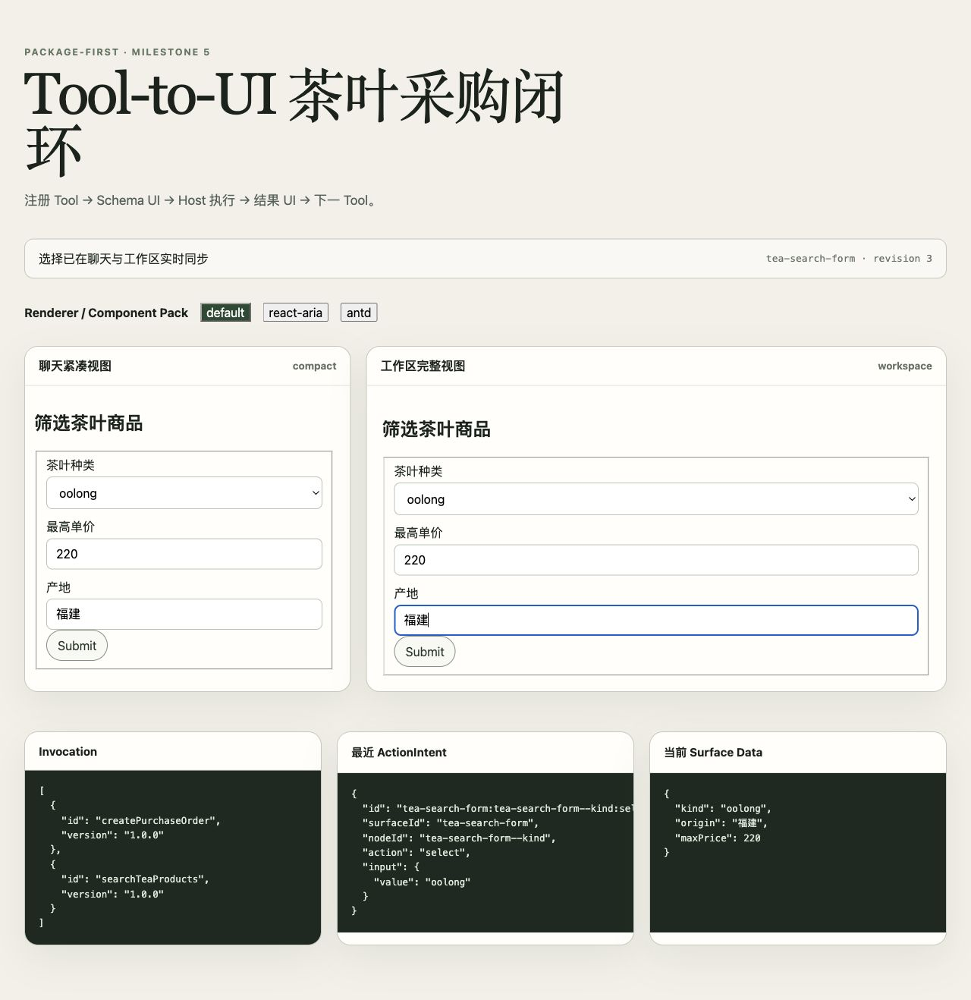

# SurfaceWeave

[](https://github.com/chenrgSix/SurfaceWeave/actions/workflows/ci.yml)
[](LICENSE)


**SurfaceWeave — A protocol-first runtime for agent-generated, tool-driven UI.**

面向 Agent 动态生成与调整业务 UI 的协议优先运行时。

> **Status:** all ten public packages are published as the experimental
> `0.1.0-rc.2`. npm `next` and `latest` resolve consistently to this RC so
> explicit prerelease and default installs cannot select the defective RC.1.
> Review the [RC.1 post-publish report](docs/rc-post-publish-validation.md) and
> [RC.2 release summary](docs/rc2-release-candidate-summary.md) before
> production use.

JSON Schema and interaction intent produce a trusted declarative `Surface`; business Agents modify it through typed UI tools; renderers subscribe to the same `SurfaceStore`; host applications execute structured `ActionIntent` values.

Milestones 1–5 implement the Surface runtime, deterministic Tool Schema generation, Tool invocation lifecycle, Agent tools, preferences, controlled Tauri bridge, and language-neutral wire protocols. The same semantic Surface can use the default React, React Aria, or Ant Design binding without changing its data. Core has no React, DOM, network-library, component-library, or Tauri dependency.

SurfaceWeave is inspired by the event-stream ideas in AG-UI and the
declarative component-tree ideas in A2UI, but is not protocol-compatible with
either project.



## SurfaceWeave in 30 Seconds

1. A business Agent or backend selects a registered Tool and may adjust its
   generated semantic Surface through typed UI tools.
2. SurfaceWeave validates and renders the Surface, retains interaction data,
   and emits structured `ActionIntent` values.
3. The host-owned executor authorizes side effects, invokes business APIs, and
   returns a result or the next Surface. SurfaceWeave does not run workflows.

## Three-Step Quick Start

```bash
nvm use 22
pnpm install --frozen-lockfile
pnpm dev
```

Open the Vite URL printed by the final command. The example runs entirely with
mock Tool results and a mock Host executor.

## Packages

| Package                            | Responsibility                                                                                   |
| ---------------------------------- | ------------------------------------------------------------------------------------------------ |
| `@surfaceweave/core`               | Wire types, Tool/Component registries, Surface and Invocation stores, Operations, and validation |
| `@surfaceweave/generator`          | Deterministic input/result Surfaces from JSON Schema and canonical Tool Definitions              |
| `@surfaceweave/agent-tools`        | Tool-to-UI orchestration and portable Agent UI tool definitions                                  |
| `@surfaceweave/preferences`        | Scoped preference composition, conflict detection, migration, and events                         |
| `@surfaceweave/react`              | Trusted React implementations and shared Store rendering                                         |
| `@surfaceweave/protocol`           | Standalone JSON Schema and language-neutral Component Pack specification                         |
| `@surfaceweave/react-aria`         | Accessible React Aria runtime bindings and styles                                                |
| `@surfaceweave/antd`               | Ant Design runtime bindings and ConfigProvider theme integration                                 |
| `@surfaceweave/storage`            | LocalStorage, memory, and host-transport persistence adapters                                    |
| `@surfaceweave/tauri`              | Allow-listed Tauri actions, Store-backed preferences, and capability descriptions                |
| `@surfaceweave/tea-purchase`       | Runnable Vite acceptance example                                                                 |
| `@surfaceweave/tea-purchase-tauri` | Runnable Tauri 2 desktop acceptance example                                                      |

## npm Installation

Install only the layers used by the host:

```bash
# Framework-independent Tool-to-UI runtime
npm install @surfaceweave/core@next @surfaceweave/generator@next @surfaceweave/agent-tools@next

# Default React renderer
npm install react react-dom @surfaceweave/react@next

# Choose zero or one optional third-party Pack
npm install react-aria-components @surfaceweave/react-aria@next
# or
npm install antd @surfaceweave/antd@next

# Optional Tauri 2 host adapter
npm install @surfaceweave/storage@next @surfaceweave/preferences@next @surfaceweave/tauri@next
```

The Protocol and Core packages never install React, DOM bindings, a Component
Pack, or Tauri. Installing the default renderer does not install React Aria or
Ant Design.

## Development

Use Node 22.13 or newer and pnpm 10:

```bash
nvm use 22
pnpm install
pnpm build
pnpm typecheck
pnpm lint
pnpm test
pnpm verify:packages
pnpm verify:release
pnpm dev
```

`pnpm dev` starts the tea-purchase flow. Submit the generated search form, select products, fill the purchase form, confirm the side effect, and inspect the result. Switch among `default`, `react-aria`, and `antd`; chat and workspace retain one Surface Store. `pnpm verify:packages` also installs the Tool Runtime from tarballs in a clean consumer.

After installing the [Tauri prerequisites](https://v2.tauri.app/start/prerequisites/), validate or run the desktop example with:

```bash
pnpm check:tauri
pnpm dev:tauri
# Release compilation without packaging an installer:
pnpm build:tauri --no-bundle
```

The desktop flow reuses the Web Tool Definitions, data model, intents, and mock Host executor while retaining Tauri Store preferences. It supports the default and Ant Design Packs; session form values and Tool results are not persisted.

## Register and Execute Tools

The host registers serializable definitions. The Runtime generates input UI and emits a request after validation and any mandatory confirmation; it never calls the business API.

```ts
import {
  AgentUIToolRuntime,
  ToolToUIRuntime,
  type ToolExecutionError,
} from "@surfaceweave/agent-tools";
import {
  InMemorySurfaceStore,
  createStandardComponentRegistry,
  type ToolHostExecutor,
} from "@surfaceweave/core";

const components = createStandardComponentRegistry();
const store = new InMemorySurfaceStore(components);
const runtime = new ToolToUIRuntime(components, store);
const hostExecutor: ToolHostExecutor = {
  async execute(request) {
    // Perform host authorization and call the registered business API here.
    return { orderId: `PO-${request.invocationId}` };
  },
};

function normalizeError(error: unknown): ToolExecutionError {
  return {
    code: "HOST_EXECUTION_FAILED",
    message: error instanceof Error ? error.message : "Unknown host error",
    retryable: false,
  };
}

runtime.registerTool({
  id: "orders.create",
  version: "1.0.0",
  inputSchema: {
    type: "object",
    required: ["buyer"],
    properties: { buyer: { type: "string" } },
  },
  outputSchema: {
    type: "object",
    required: ["orderId"],
    properties: { orderId: { type: "string" } },
  },
  annotations: { sideEffect: true, confirmation: "required", retry: "safe" },
});

const { invocation, surface } = runtime.createToolSurface({
  toolId: "orders.create",
  surfaceId: "order-form",
  initialValues: { buyer: "Ada" },
});

runtime.onInvocationRequested(async (request) => {
  try {
    runtime.markInvocationStarted(request.invocationId);
    const result = await hostExecutor.execute(request);
    runtime.resolveInvocation(request.invocationId, result);
  } catch (error) {
    runtime.rejectInvocation(request.invocationId, normalizeError(error));
  }
});

const agentTools = new AgentUIToolRuntime(
  components,
  store,
  undefined,
  runtime,
);

const confirmation = runtime.handleAction({
  id: "submit-order",
  surfaceId: surface.id,
  nodeId: surface.tree.id,
  action: "tool.submit",
  input: { invocationId: invocation.id },
});
if (confirmation.kind !== "confirmation-required") {
  throw new Error("Expected side-effect confirmation");
}
runtime.handleAction({
  id: "confirm-order",
  surfaceId: confirmation.confirmationSurface.id,
  nodeId: confirmation.confirmationSurface.tree.id,
  action: "tool.submit",
  input: { invocationId: invocation.id, confirmed: true },
});
void agentTools;
```

`fromOpenApiOperation` and `fromAgentToolDefinition` convert definitions only; they never retain execution authority. Renderer actions go through `runtime.handleAction(intent)`. Side-effect confirmation, registered tool/version checks, read-only projection, duplicate submission, idempotency, sensitive event redaction, and retry policy are Runtime invariants.

## Register a Component Pack

Install only the bindings used by the host:

```bash
npm install @surfaceweave/core@next @surfaceweave/react@next react react-dom
npm install @surfaceweave/react-aria@next react-aria-components
# or
npm install @surfaceweave/antd@next antd
```

The serializable Manifest and local React bindings are separate. Registering a Pack adds its trusted semantic schemas to Core, while the binding stays in the React package.

```tsx
import { createStandardComponentRegistry } from "@surfaceweave/core";
import { createStandardReactComponentRegistry } from "@surfaceweave/react";
import { createReactAriaComponentPack } from "@surfaceweave/react-aria";
import "@surfaceweave/react-aria/styles.css";

const components = createStandardComponentRegistry();
const reactComponents = createStandardReactComponentRegistry(components);
reactComponents.registerPack(createReactAriaComponentPack({ locale: "en-US" }));
```

Ant Design accepts host-only `ConfigProvider` options through `createAntDesignComponentPack({ theme, locale })`; those values never enter the Surface or Manifest. See [Component Pack authoring](docs/component-pack-authoring.md) for custom semantic components and fallback.

## Create and Render a Surface

```tsx
import {
  InMemorySurfaceStore,
  createStandardComponentRegistry,
} from "@surfaceweave/core";
import { generateSurface } from "@surfaceweave/generator";
import {
  SurfaceRenderer,
  createStandardReactComponentRegistry,
} from "@surfaceweave/react";

const components = createStandardComponentRegistry();
const store = new InMemorySurfaceStore(components);
store.createSurface(
  generateSurface(
    {
      surfaceId: "profile",
      intent: "form",
      schema: {
        type: "object",
        properties: { name: { type: "string", title: "Name" } },
      },
      data: { name: "Ada" },
    },
    components,
  ),
);

const reactComponents = createStandardReactComponentRegistry(components);

export function Profile() {
  return (
    <SurfaceRenderer
      surfaceId="profile"
      store={store}
      componentRegistry={components}
      reactComponents={reactComponents}
      preferredPack="react-aria"
      enabledPackIds={["react-aria", "default"]}
      capabilities={["web"]}
      onActionIntent={(intent) => hostActionExecutor.execute(intent)}
    />
  );
}
```

## Connect Agent Tool Calls

Pass `runtime.definitions()` to the host Agent SDK, then route returned calls through the host-neutral runtime. Invalid arguments and revision conflicts are returned as data.

```ts
import { AgentUIToolRuntime } from "@surfaceweave/agent-tools";

const runtime = new AgentUIToolRuntime(components, store);
const definitions = runtime.definitions();

const result = runtime.execute(toolCall.name, JSON.parse(toolCall.arguments));
if (!result.ok) {
  console.error(result.error.code, result.error.message);
}
```

Call `ui.inspectComponentPacks` to give an Agent the current semantic component schemas, capabilities, fallback, renderer/pack identifiers, and concise `agentGuidance`. The result is JSON-only and never exposes React components or vendor APIs.

`ui.applyOperations` and `ui.replaceSurface` are session-only overrides: they update the Surface Store but never persist user preferences. Use the separate async preference runtime for confirmed long-term changes.

## Persist and Apply Preferences

Hydrate preferences before creating Surfaces, then pass the service into the Surface tool runtime. Preference operations target `stableId`, not generated node IDs or array indexes.

```ts
import type { PreferenceDocument } from "@surfaceweave/core";
import {
  AgentUIToolRuntime,
  PreferenceAgentToolRuntime,
} from "@surfaceweave/agent-tools";
import {
  PreferenceRepository,
  PreferenceService,
  parsePreferenceDocument,
} from "@surfaceweave/preferences";
import { LocalStorageAdapter } from "@surfaceweave/storage";

const adapter = new LocalStorageAdapter<PreferenceDocument>(
  "dynamic-ui.preferences.v1",
  parsePreferenceDocument,
);
const preferences = new PreferenceService(
  new PreferenceRepository(adapter),
  components,
);
await preferences.hydrate();

const surfaces = new AgentUIToolRuntime(components, store, preferences);
const preferenceTools = new PreferenceAgentToolRuntime(preferences);
```

For remote persistence, inject a host-owned transport into `BackendStorageAdapter`; the SDK never chooses an endpoint, credentials, or `fetch` policy. Long-term writes require `ui.savePreference` with `confirmed: true`. Applicable patches compose deterministically as `global` → `intent` → `tool`; developer hard constraints always win, while soft hints affect only default generation.

Choose persistence by host: `LocalStorageAdapter` for browser-only apps, `TauriPreferenceStorage` for a desktop app's official Store plugin, or `BackendStorageAdapter` for a host-owned service. Only versioned preference documents belong there—never Surface form data or Tool results.

When a schema changes, keep compatible `stableId` values. Supply `schemaRef` and `fieldAliases` during `ui.createSurface` for renamed fields. Aliases create an explicit conflict suggestion—they never silently rewrite durable preferences. Resolve with `ui.migratePreference` or remove with `ui.discardPreference`; subscribe to `preference.conflicted`, `preference.migrated`, and `preference.discarded` events for host UI feedback.

## Handle Actions

Renderer components emit JSON-only `ActionIntent` values. Route them to a host `ActionExecutor` that performs authorization, confirmation, idempotency, and network access; never place functions or source code in an intent.

In Tauri, register semantic host actions and let trusted handlers choose fixed Rust command names:

```ts
import { createTauriDynamicUIAdapter } from "@surfaceweave/tauri";

const desktop = createTauriDynamicUIAdapter({
  namespace: "tea-purchase",
  userId: currentUser.id,
  capabilities: {
    platform: "macos",
    desktop: true,
    filePicker: false,
    notifications: false,
    localStorage: true,
    nativeCommands: true,
  },
});

desktop.actionExecutor.register("tea.search", async (input, { invoke }) =>
  invoke("search_teas", { query: input }),
);
```

The security chain is: trusted component emits an `ActionIntent` → semantic action allow-list validates it → host handler selects a fixed command → Tauri capability authorizes that command → Rust validates the payload. A capability descriptor is UI discovery metadata, not authorization. The example grants only its two application commands and the Store operations it uses; it does not grant shell, filesystem, HTTP, or arbitrary command access, and its CSP permits only bundled assets, IPC, and the local Vite development endpoint.

## Peer Dependencies

The default renderer supports React `>=18.2 <20`. React Aria additionally needs
React DOM `>=18.2 <20` and `react-aria-components >=1.20 <2`. Ant Design needs
React DOM `>=18.2 <20` and `antd >=6.5.3 <7`. These libraries are peers of their
optional Pack and are not pulled into Core or unrelated consumers. Tauri is a
separate package and installs only its Tauri 2 API/Store dependencies.

See the [public API baseline](docs/public-api.md), [compatibility matrix](docs/npm-compatibility-matrix.md), [release checklist](docs/npm-release-checklist.md), [Trusted Publishing guide](docs/npm-trusted-publishing.md), [Tool-to-UI guide](docs/tool-to-ui-runtime.md), [no-workflow ADR](docs/adr/0001-no-frontend-workflow-engine.md), and [architecture baseline](docs/dynamic-ui-architecture.md).
