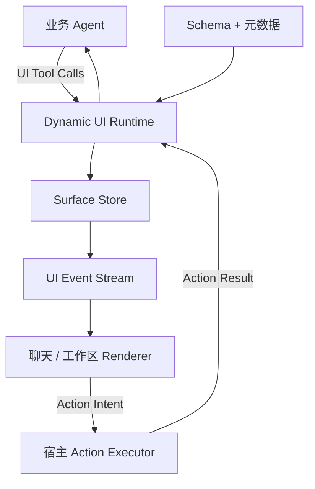
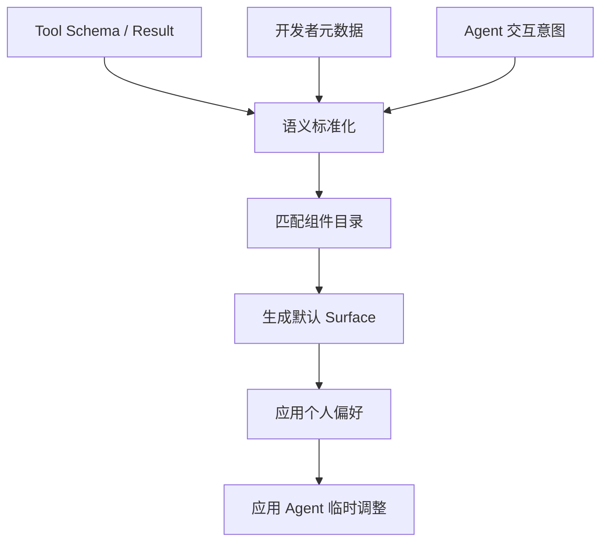

方案可以定为：**Package-first 的对话式动态 UI SDK**。核心使用框架无关的 TypeScript 数据模型，首个渲染器做 React/Web，Tauri 直接复用 Web 渲染器；后续再扩展 Vue、Flutter 等终端。

它借鉴 [AG-UI](https://docs.ag-ui.com/introduction) 的事件流和 [A2UI](https://a2ui.org/) 的声明式组件树，但定义自己的轻量协议，不强求兼容。

## 一、系统定位

模块负责：

* 根据 Tool Schema、返回数据和交互意图生成可靠默认 UI；
* 维护动态 surface、临时表单数据和 UI 状态；
* 接收业务 Agent 的 UI Tool Calls；
* 支持增量调整与整体重构；
* 同步聊天内 UI 与独立工作区；
* 保存用户的结构化 UI 偏好；
* 将组件动作交给宿主执行。

模块不负责：

* 业务 Agent 的规划与模型调用；
* 业务接口实现和权限系统；
* 提交后的冻结、恢复等业务生命周期；
* 创建新的业务数据模型；
* 执行 Agent 生成的任意代码；
* 完整的工作流编排。

## 二、总体架构



核心原则是：

> Agent 表达 UI 意图，Runtime 负责验证和状态转换，Renderer 只渲染合法状态。

Agent 不直接生产底层事件，也不直接执行组件动作。

### Component Pack Protocol（Milestone 4）

组件系统分为三个不可混合的层次：

1. `@package-first/protocol` 提供语言无关的 JSON Wire Protocol 和 Draft 2020-12 JSON Schema；
2. `ComponentPackManifest` 是可序列化组件能力、Schema、fallback 和 Agent 提示；
3. `ReactComponentPack` 等 Runtime Binding 才包含本地框架组件与 Provider。

TypeScript Core 是参考实现，不是协议定义。Surface 只保存 `TextInput`、`ChoiceField`、`Card` 等语义类型；切换 `react/default`、`react/react-aria`、`react/antd`，以及未来的 `vue/element-plus` 或 `flutter/material` 时，不改写 Surface、DataBinding、`stableId` 或 Preference Patch。Renderer 只能启用宿主明确许可且能力兼容的 Pack；缺少业务组件实现时沿语义 fallback 降级。

## 三、建议包结构

| 包                               | 职责                                |
| ------------------------------- | --------------------------------- |
| `@scope/dynamic-ui-core`        | Surface、组件树、数据绑定、Operations、事件和校验 |
| `@scope/dynamic-ui-generator`   | 根据 Schema、数据和意图生成默认 UI            |
| `@scope/dynamic-ui-agent-tools` | 向业务 Agent 暴露类型化 UI Tools          |
| `@scope/dynamic-ui-react`       | React/Web Renderer，支持聊天和工作区       |
| `@scope/dynamic-ui-storage`     | Memory、LocalStorage 和自定义后端存储接口    |
| `@scope/dynamic-ui-tauri`       | Tauri Action Executor、Store 与事件桥接 |
| `@scope/dynamic-ui-devtools`    | 查看 Surface、Operations、事件和偏好应用过程   |

当前仓库还提供 `@package-first/protocol`、`@package-first/component-pack-react-aria` 和 `@package-first/component-pack-antd`。第三方 UI 库只存在于各自 Pack 的 peer/dev dependencies；Core 不依赖 React、DOM、Tauri 或任何组件库。

核心包不依赖 React、Tauri 或特定 Agent SDK。

## 四、核心数据模型

### Surface

一个 surface 是一份逻辑 UI，聊天和工作区只是它的不同呈现。

```ts
interface Surface {
  id: string
  revision: number
  intent: UIIntent
  schemaRef?: SchemaRef
  tree: UINode
  data: Record<string, unknown>
  context: SurfaceContext
}
```

### UI Node

```ts
interface UINode {
  id: string
  stableId?: string
  component: string
  props: Record<string, unknown>
  binding?: DataBinding
  children?: UINode[]
}
```

要求：

* `id` 标识本次 surface 节点；
* `stableId` 关联长期有效的业务字段或语义；
* 表单数据与组件树分离；
* 调整布局时不移动或复制业务数据；
* 组件替换后，只要绑定兼容，就继续使用原值。

### 个人偏好

不保存完整 UI 快照，而保存相对于默认 UI 的结构化修改：

```ts
interface PreferencePatch {
  id: string
  scope: "global" | "intent" | "tool"
  targetStableId: string
  operation: UIOperation
  schemaVersion?: string
}
```

本地存储适合单设备；宿主数据库适合跨设备、跨终端同步。

## 五、默认 UI 生成流程



生成顺序：

1. 解析 JSON Schema、OpenAPI 或类似 Tool Schema。
2. 合并开发者元数据。
3. 根据 Agent 提供的意图区分浏览、单选、多选、编辑、比较和确认。
4. 从当前终端支持的组件目录中选择组件。
5. 生成确定性的默认 UI。
6. 应用长期个人偏好。
7. 应用 Agent 针对当前任务的临时调整。

优先级为：

1. 接口、安全和权限硬约束；
2. 终端能力；
3. 用户本轮明确指令；
4. Agent 当前任务临时调整；
5. 用户历史偏好；
6. 开发者软建议；
7. 模块默认规则。

Agent 可以临时覆盖历史偏好，但必须提供原因，且不能自动改写长期偏好。

## 六、组件注册机制

标准组件包括：

* Text、Image、Badge；
* Stack、Grid、Tabs、Accordion；
* TextInput、NumberInput、Select、Checkbox；
* Form、Table、CardList；
* Button、Confirm、EmptyState、ErrorState。

业务组件由开发者注册：

```ts
registry.register({
  type: "TeaProductCard",
  propsSchema,
  bindings: {
    value: { type: "string", semantic: "productId" }
  },
  actions: ["select", "preview"],
  capabilities: ["web", "desktop"],
  fallback: "SelectableCard"
})
```

每个组件需要描述：

* 属性 Schema；
* 接受和输出的数据语义；
* 支持的动作；
* 适用终端；
* 是否存在副作用；
* 可替换组件或降级组件。

Agent 只能组合已注册组件，不能生成 React 代码。

Manifest 由 `validateComponentPack` 校验，Runtime Binding 由对应 Renderer 校验。解析顺序考虑 `rendererKind`、宿主启用列表、终端 capabilities、`preferredPack`、开发者优先级、宿主接受的 Pack 版本和 fallback 链，并为不兼容选择产生诊断。`agentGuidance` 只帮助 Agent 选择语义组件，不能覆盖 JSON Schema、hard constraints、安全策略或 ActionIntent 执行规则。厂商特性只能进入带 namespace、版本和 JSON Schema 的 `extensions`；默认 Generator 和 Agent 不主动生成这些扩展。

## 七、Agent UI Tools

建议提供四个主要工具。

Milestone 4 额外提供 `ui.inspectComponentPacks`，只返回可序列化的语义组件目录和 Manifest，不返回 React 绑定或第三方库 API。

### `ui.createSurface`

根据数据、Schema 和交互意图创建默认 UI。

### `ui.inspectSurface`

让 Agent 查询当前 surface 的摘要、字段、分组和组件，不必把整棵树塞进上下文。

### `ui.applyOperations`

执行批量语义修改：

```json
{
  "surfaceId": "purchase-form",
  "baseRevision": 12,
  "reason": "用户希望收货信息更显眼",
  "operations": [
    {
      "type": "moveNode",
      "target": "purchase.shipping",
      "position": "first"
    },
    {
      "type": "setPresentation",
      "target": "purchase.remark",
      "presentation": {
        "collapsed": true
      }
    }
  ]
}
```

Operations 至少支持：

* `moveNode`
* `replaceComponent`
* `setProps`
* `setLayout`
* `setVisibility`
* `groupNodes`
* `removeNode`
* `insertNode`

不建议向 Agent 暴露基于数组下标的 JSON Patch。

### `ui.replaceSurface`

用于把普通表单整体改成分步向导、看板等大规模重构。

所有写操作携带 `baseRevision`，避免聊天和工作区并发修改时覆盖新状态。

## 八、事件模型

Runtime 验证 Tool Call 后，再产生确定性事件：

* `surface.created`
* `surface.operationsApplied`
* `surface.replaced`
* `surface.dataChanged`
* `surface.validationChanged`
* `action.requested`
* `action.completed`
* `preference.conflicted`

Renderer 订阅这些事件。聊天和工作区连接同一个 Surface Store，因此不需要两个视图之间相互同步数据。

## 九、组件动作执行

组件不直接调用任意 URL 或 Tauri Command，而是发出：

```ts
interface ActionIntent {
  id: string
  surfaceId: string
  nodeId: string
  action: string
  input: unknown
  idempotencyKey?: string
}
```

宿主注册映射：

```ts
executor.register("tea.search", searchTea)
executor.register("purchase.create", createPurchase)
```

执行结果同时返回：

* 当前组件；
* Surface Store；
* 业务 Agent。

创建、删除、支付等副作用动作必须支持确认、幂等键和宿主权限检查。

## 十、UI 调整与状态保留

调整分为两个风险等级：

* 布局、颜色、顺序、折叠等呈现修改可以即时生效并撤销；
* 默认值、条件行为、组件动作和长期偏好修改需要用户确认。

增量修改默认保留当前数据。

整体替换时：

1. 根据 `stableId` 和数据绑定迁移兼容值；
2. 不兼容的字段提示用户；
3. 用户确认后才允许丢弃无法迁移的数据。

表单数据仅保存在当前会话，不进入长期偏好存储。

## 十一、Schema 升级与偏好迁移

推荐开发者为接口、字段和组件提供：

* 稳定语义 ID；
* Schema 版本；
* 可选的字段别名和迁移映射。

当个人修改无法应用：

1. 优先使用确定性迁移映射；
2. 无明确映射时产生 `preference.conflicted`；
3. 业务 Agent 获取旧修改和新 Schema；
4. Agent 向用户解释变化；
5. 用户选择迁移或丢弃。

Agent 不能静默执行模糊迁移。

## 十二、Tauri 接入

Tauri 前端运行在系统 WebView 中，React Renderer 可以直接使用；Rust 后端通过消息传递与前端通信。[Tauri 架构](https://v2.tauri.app/concept/architecture/)

`@scope/dynamic-ui-tauri` 只需负责：

* 把 Action Intent 映射到受控 Rust Command；
* 将 Rust 事件映射成 Runtime 事件；
* 接入 Tauri Store 或 SQL 保存个人偏好；
* 提供平台能力描述，例如文件、通知、摄像头。

必须使用动作白名单，并结合 [Tauri Capabilities](https://v2.tauri.app/security/capabilities/) 限制不同窗口可调用的能力。AI 不能直接指定任意 Command 名称。

Milestone 3 将该边界落实为 `@package-first/tauri`：`TauriActionExecutor` 只执行宿主注册的语义动作，注册处理器再选择固定 Rust Command；`TauriPreferenceStorage` 通过官方 Store 插件保存现有版本化偏好文档；`TauriCapabilityProvider` 仅描述平台能力，不参与授权；`createTauriDynamicUIAdapter` 组合这些宿主适配器。

动作白名单和 Tauri Capability 是两道独立边界。前者拒绝未知动作、可执行代码字段和 URL 注入，后者限制窗口实际可调用的 Command。示例只声明 `search_teas`、`create_purchase` 及必要的 Store 权限，不启用 shell、文件系统、HTTP 或任意命令能力；CSP 仅允许打包资源、IPC 和本地 Vite 开发端点。Store 只保存带 Schema 版本的长期偏好，不保存 Surface 表单数据和 Tool Result。

Pretext 暂不作为核心依赖，只在虚拟列表或特殊文本排版组件中可选使用。

## 十三、落地阶段

### 第一阶段：可验证 MVP

* TypeScript Core；
* JSON Schema 默认表单生成；
* React Renderer；
* Memory Surface Store；
* UI Tools；
* 增量 Operations；
* 聊天和工作区共享状态；
* Action Executor；
* 茶叶选择 → 采购单演示。

### 第二阶段：个人化

* LocalStorage 与后端 Storage Adapter；
* 结构化 Preference Patch；
* 全局、场景和 Tool 级偏好；
* 整体替换；
* Schema 冲突检测与迁移交互。

### 第三阶段：生态接入

* Tauri Adapter（Milestone 3 已完成）；
* 自定义业务组件 SDK；
* DevTools；
* Agent 框架适配示例；
* OpenAPI/MCP Tool Schema 转换器。

### 第四阶段：跨终端

* Vue 或其他 Web Renderer；
* Flutter/原生 Renderer；
* 终端能力协商和组件降级；
* 可选 AG-UI/A2UI 转换层。

## 十四、第一条完整验收链路

1. 用户：“我想购买茶叶。”
2. Agent 查询茶叶接口。
3. Agent 调用 `ui.createSurface`，意图为多选。
4. 模块生成茶叶卡片选择器。
5. 用户选择商品，组件发出 Action Intent。
6. Agent 获得选择结果并进入采购步骤。
7. 模块根据采购 Tool Schema 生成默认表单。
8. 用户：“把收货信息放最前，备注折叠。”
9. Agent 调用 `ui.applyOperations`。
10. 已填写数据保持，聊天与工作区同步更新。
11. 用户：“以后采购单都这样。”
12. 模块展示长期影响，用户确认后保存 Preference Patch。
13. 下次采购时，模块先生成最新默认 UI，再叠加个人修改。

最先应该冻结的不是组件样式，而是三个协议对象：**Surface、UIOperation、ActionIntent**。这三者稳定后，Renderer、Agent Adapter、Storage 和 Tauri 接入都能独立推进。
